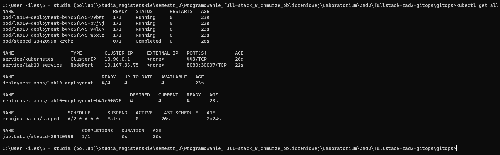
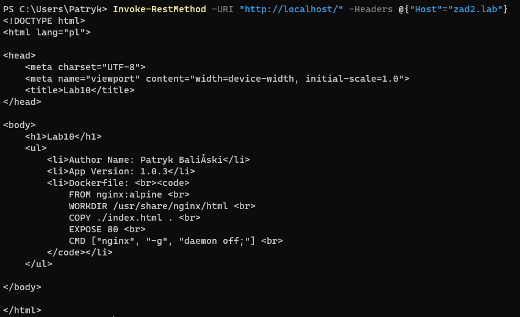
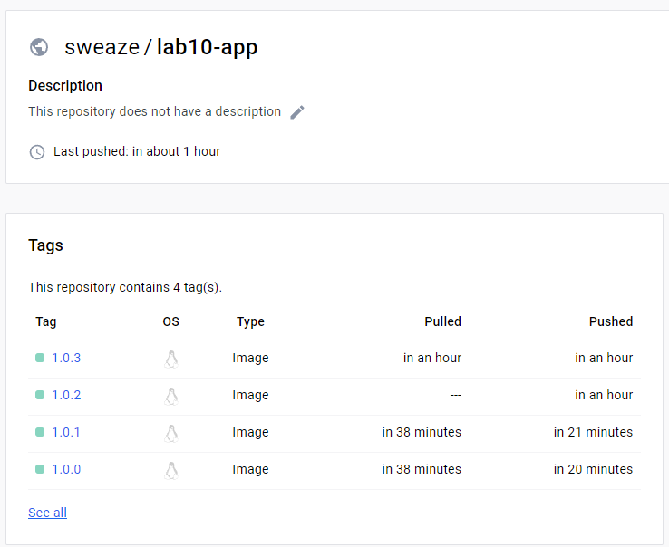
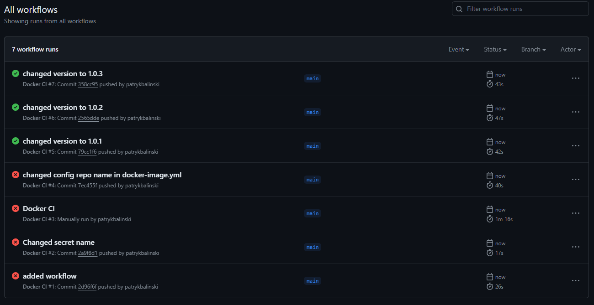
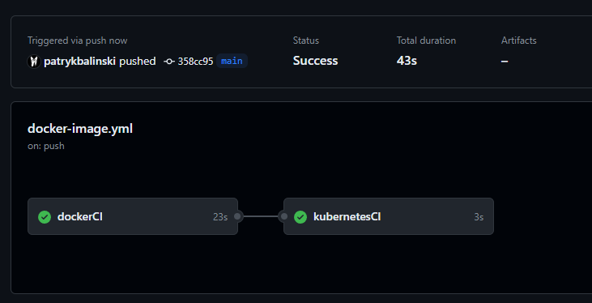
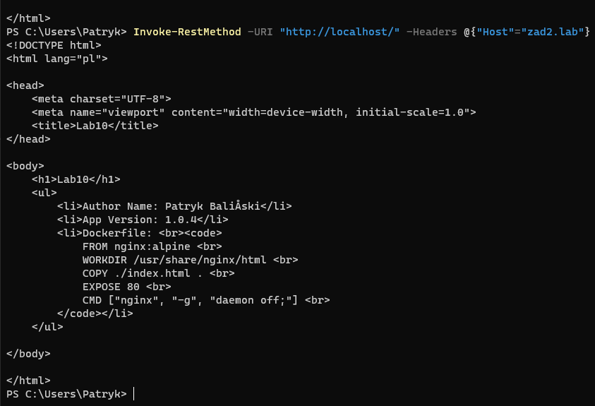
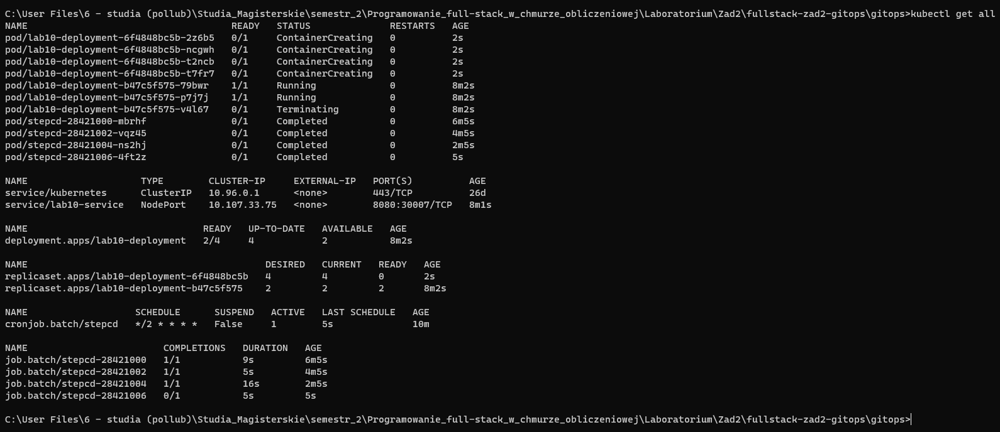

# Repozytoria

-   https://github.com/patrykbalinski/fullstack-zad2-gitops
-   https://github.com/patrykbalinski/fullstack-zad2-config
-   https://github.com/patrykbalinski/fullstack-zad2-source

# 1A

### index.html

```html
<!DOCTYPE html>
<html lang="pl">
    <head>
        <meta charset="UTF-8" />
        <meta name="viewport" content="width=device-width, initial-scale=1.0" />
        <title>Lab10</title>
    </head>

    <body>
        <h1>Lab10</h1>
        <ul>
            <li>Author Name: Patryk Baliński</li>
            <li>App Version: 1.0.4</li>
            <li>
                Dockerfile: <br /><code>
                    FROM nginx:alpine <br />
                    WORKDIR /usr/share/nginx/html <br />
                    COPY ./index.html . <br />
                    EXPOSE 80 <br />
                    CMD ["nginx", "-g", "daemon off;"] <br />
                </code>
            </li>
        </ul>
    </body>
</html>
```

### dockerfile

```dockerfile
FROM nginx:alpine
WORKDIR /usr/share/nginx/html
COPY ./index.html .
EXPOSE 80
CMD ["nginx", "-g", "daemon off;"]
```

# 1B

### deployment

```yaml
apiVersion: apps/v1
kind: Deployment
metadata:
  name: lab10-deployment
spec:
  replicas: 4
  selector:
    matchLabels:
      app: lab10-app
  strategy:
    type: RollingUpdate
    rollingUpdate:
      maxSurge: 5
      maxUnavailable: 2
  template:
    metadata:
      labels:
        app: lab10-app
    spec:
      containers:
        - name: lab10-app
          image: sweaze/lab10-app:1.0.0

```

### ingress

```yaml
apiVersion: networking.k8s.io/v1
kind: Ingress
metadata:
  name: lab10-ingress
spec:
  rules:
  - host: zad2.lab
    http:
      paths:
      - pathType: Prefix
        path: "/"
        backend:
          service:
            name: lab10-service
            port:
              number: 8080
```

### service

```yaml
apiVersion: v1
kind: Service
metadata:
  name: lab10-service
spec:
  type: NodePort
  ports:
    - port: 8080
      targetPort: 80
      nodePort: 30007
  selector:
    app: lab10-app
```

# 2

### workflow

```yaml
name: Docker CI

on:
  workflow_dispatch:
  push:
    branches: [ "main" ]
  pull_request:
    branches: [ "main" ]

jobs:

  dockerCI:
    runs-on: ubuntu-latest
    outputs:
      version_number: ${{ steps.vars.outputs.version_number }}

    steps:
    - name: Check out the repo
      uses: actions/checkout@v4

    - name: Set up QEMU
      uses: docker/setup-qemu-action@v3

    - name: Set up Docker Buildx
      uses: docker/setup-buildx-action@v3

    - name: set-output
      id: vars
      run: |
        version_number=$(sed -n 's/.*App Version: \(.*\)<\/li>/\1/p' index.html)
        echo "version_number=${version_number}" >> "$GITHUB_OUTPUT"
      shell: bash

    - name: Login to Docker Hub
      uses: docker/login-action@v3
      with:
        username: ${{ secrets.DOCKER_HUB_LOGIN }}
        password: ${{ secrets.DOCKER_HUB_PASSWORD }}

    - name: Build and push
      uses: docker/build-push-action@v5
      with:
        context: .
        platforms: linux/amd64,linux/arm64
        push: true
        tags: sweaze/lab10-app:${{ steps.vars.outputs.version_number}}

  kubernetesCI:
    needs: dockerCI
    runs-on: ubuntu-latest

    steps:
      - name: Check out the repo
        uses: actions/checkout@v4
        with:
          repository: patrykbalinski/fullstack-zad2-config
          token: ${{ secrets.FULLSTACK_TOKEN }}
      - run: |
          sed -i 's/sweaze\/lab10-app:.*/sweaze\/lab10-app:${{ needs.dockerCI.outputs.version_number }}/g' lab10-deployment.yaml
          git config user.name github-actions
          git config user.email github-actions@github.com
          git add -u
          git commit -m "updated app version ${{ needs.dockerCI.outputs.version_number }}"
          git push
```

# 3A

### gitops

```dockerfile
FROM alpine:latest

RUN apk update && \
    apk add --no-cache git curl && \
    apk add --no-cache --repository=http://dl-cdn.alpinelinux.org/alpine/edge/community kubectl

CMD ["/bin/sh"]
```

# 3B

### StepCD 

```yaml
apiVersion: batch/v1
kind: CronJob
metadata:
  name: stepcd
spec:
  schedule: "*/2 * * * *"
  concurrencyPolicy: Forbid
  jobTemplate:
    spec:
      backoffLimit: 0
      template:
        spec:
          restartPolicy: Never
          serviceAccountName: gitops
          containers:
            - name: zad2gitops 
              image: sweaze/lab10-stepcd
              command: [sh, -e, -c]
              args:
                - git clone https://github.com/patrykbalinski/fullstack-zad2-config.git /tmp/lab10_config && find /tmp/lab10_config -name '*.yaml' -exec kubectl apply -f {} \;
```

# 4A

```bash
docker build -t sweaze/lab10-stepcd .
docker login
docker push sweaze/lab10-stepcd:latest

kubectl create sa gitops
kubectl create clusterrolebinding gitops-admin --clusterrole=cluster-admin --serviceaccount default:gitops

kubectl apply -f .\operator-stepcd.yaml
kubectl get all

minikube tunnel
Invoke-RestMethod -URI "http://localhost/" -Headers @{"Host"="zad2.lab"}
```





# 4B









